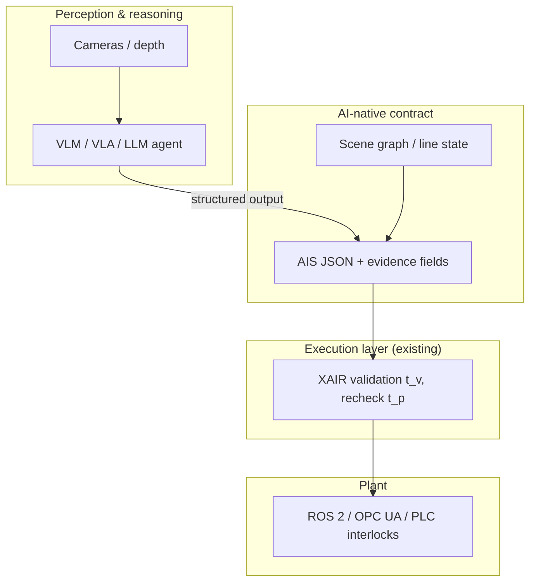

# Visione — Paper 2: AI-native Action Intents

## Perché adesso

Il paper execution-gap ha dimostrato **dove** nasce la stale actuation (cache, \(t_v\)/\(t_p\), drift) e **che cosa** misurare (SER, protocollo dichiarato).  
Il passo successivo non è “più middleware”, ma **integrare l’AI come produttore di intent** senza perdere auditabilità e fail-closed semantics.

L’AI industriale oggi non è solo un classificatore: sono **Vision-Language-Action (VLA)**, **agenti tool-use**, **modelli multimodali on-prem/edge**, **structured output** verso API typed. Tutti condividono lo stesso rischio sistemico: **output plausibile ≠ azione ammissibile al momento della pubblicazione**.

## Tesi del paper 2

> L’AI deve produrre **Action Intents (AIS)** strutturati e sottoporsi a **validazione execution-time (XAIR)**; non deve pubblicare direttamente su ROS/OPC UA/MES.

In altre parole: **decoupling** tra *reasoning/perception* e *authorization to actuate* — con l’AI che migliora la *qualità* degli intent (precondizioni esplicite, grounding visivo) e XAIR che garantisce la *tempestività* contestuale.

## Cosa cambia rispetto al paper 1

| Aspetto | Paper 1 (execution-gap) | Paper 2 (AI-native) |
|---------|-------------------------|---------------------|
| Produttore intent | Script HTTP / Unity replay | VLA, LLM agent, CV pipeline |
| Focus valutazione | Cache coherence, TOCTOU | Grounding + latency AI + stale actuation |
| Contratto | AIS v0.1 | AIS + **AI binding** (source, confidence, evidence) |
| Claim | Publication-boundary governance | **AI-augmented** intents with same gate |

## Tecnologie da inserire (radar 2025–26)

### 1. Vision-Language-Action (VLA)

Modelli end-to-end (es. famiglia RT-2, OpenVLA, π₀) mappano percezione → azione.  
**Limite:** il gap algorithmic *interno* al modello non sostituisce il gap *di sistema* tra inferenza e plant state.

**Opportunità:** usare VLA come **proposer** di `action_type` + parametri; XAIR valuta precondizioni su snapshot MES/linea.

### 2. LLM / VLM agentici (tool use)

Agenti con: planning loop, tool calling, memoria, multi-step.  
**Pattern:** `observe → plan → call_tool(submit_ais_intent)` invece di `call_tool(move_robot)`.

Tecnologie rilevanti: structured outputs (JSON schema), function calling, agent frameworks (LangGraph, AutoGen-style), **coding agents** per synthesize BT/skill (cf. contract-grounded runtimes).

### 3. Structured output verso AIS

Obbligare il modello a emettere JSON validato da `schemas/action-intent-v1.json` + campi estesi:

- `evidence`: frame id, detection ids, salient regions  
- `confidence` / `calibration`  
- `grounded_preconditions`: precondizioni derivate da scene graph  
- `model_id`, `prompt_hash`, `inference_latency_ms`

### 4. Runtime assurance & shields (complementari)

Shield / filter / Simplex restano sul **controllo continuo** o su policy formali.  
XAIR resta sul **intent discreto multi-producer** — complementare, non sostitutivo.

### 5. Edge / fog inference

Inferenza locale (TensorRT, ONNX, small VLM) per ridurre \(\Delta_v\), ma **non elimina** drift post-inferenza.  
Paper 2 misura trade-off: latenza modello vs SER sotto drift controllato.

## Architettura proposta (bozza)

## Domande di ricerca (draft)

1. **RQ-A1 (Grounding):** Precondizioni AIS generate da VLM riducono SER rispetto a comandi “raw” sotto lo stesso drift protocol?
2. **RQ-A2 (Latency):** Qual è l’accettabile \(\Delta_v\) inferenza AI prima che SER domini rispetto a errori di grounding?
3. **RQ-A3 (Agents):** Un agente multi-step con tool AIS ottiene meno stale actuation di un VLA monolitico?
4. **RQ-A4 (Audit):** Evidence fields bastano a ricostruire *perché* un intent è stato revocato (explainability operativa, non XAI accademico)?

## Venue target (da decidere)

- IEEE TII / TIM (continuità industriale)  
- IEEE RA-L + ICRA/IROS short arc  
- Journal on AI for engineering / robotics foundations  

## Deliverable implementativi (repo XAIR)

1. `experiments/run_a1_vlm_ais.py` — Ollama VLM → AIS → adapter  
2. Schema `action-intent-v1-ai.json` (estensione opzionale)  
3. Adapter mode `ai_proposed` + logging evidence  
4. Confronto baseline: `direct_vla` vs `ais_xair`

## Compute (NVIDIA L40)

Nodo Tailscale `100.86.223.16` (`dagati-llm169`, user `ml`): **L40 46 GB**, Ollama con Qwen3-Coder / Qwen3.  
Dettagli e accesso sicuro (senza password in repo): [`notes/compute-gpu.md`](notes/compute-gpu.md).

Pipeline prevista: **Ollama su L40** genera AIS JSON → **XAIR sull’host di sviluppo** valida e pubblica → stessi metric SER/CRR del Paper 1.
